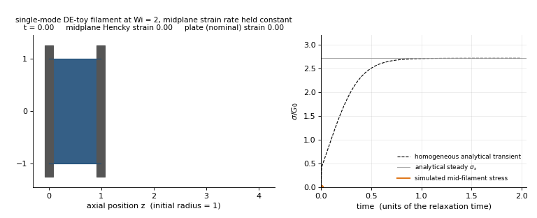
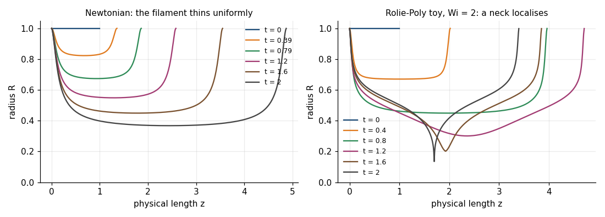
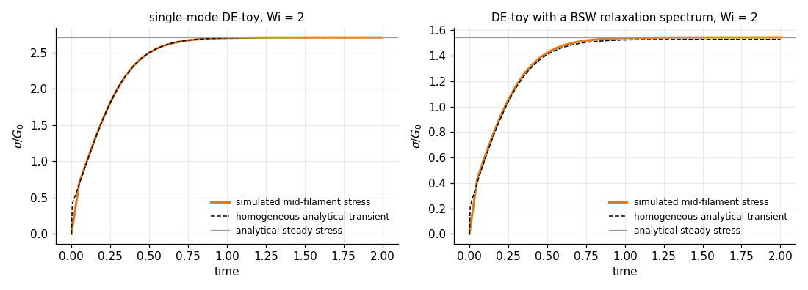
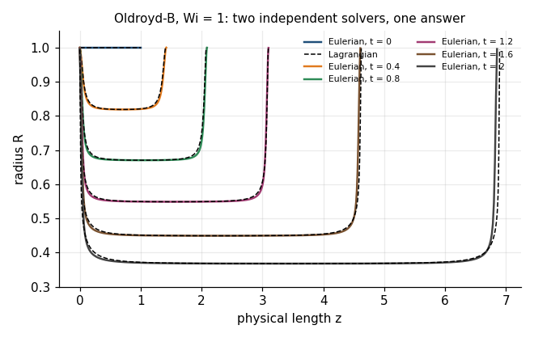
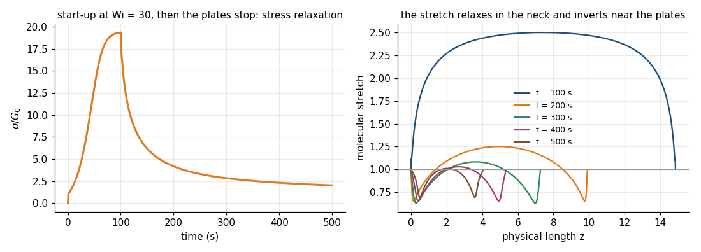
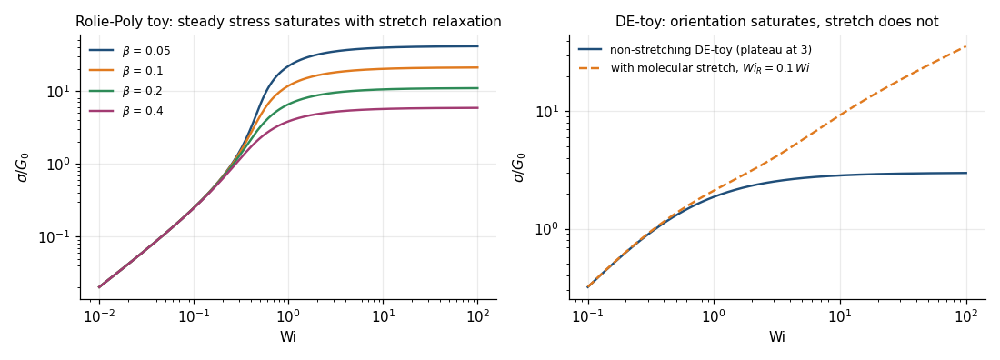
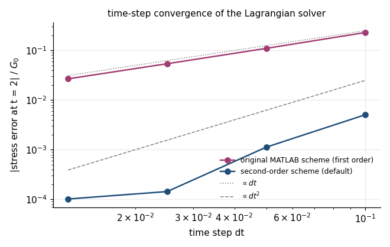

<div align="center">

# Filament stretching of model liquids

**A Python reproduction of Hassager, Wang & Huang, *Physics of Fluids* 33, 123108 (2021): controlled filament-stretching simulations of Newtonian, Oldroyd-B, Rolie-Poly and Doi-Edwards model liquids, with an Eulerian and a Lagrangian slender-filament solver.**

[](https://github.com/ktwyw/hassager2021-filament-stretching/actions/workflows/tests.yml)
[](https://doi.org/10.1063/5.0076347)
[](pyproject.toml)
[](LICENSE)
[](https://orcid.org/0000-0002-8488-9833)



*A single-mode DE-toy filament at Wi = 2 with the midplane strain rate held constant. The filament necks, the plates advance and then **reverse** to keep the rate constant, and the mid-filament stress (orange) follows the homogeneous analytical transient (dashed) onto the steady value - the paper's central result, from the Lagrangian solver.*

</div>

In a filament-stretching rheometer the sample is a liquid bridge between two plates, and only its midplane is in
pure extension; a controller moves the plates so that the midplane strain rate stays constant while the
filament necks. The paper asks how well the stress measured at that midplane represents the homogeneous
extensional stress of the material, for liquids ranging from Newtonian to entangled polymer melts. This
repository rebuilds its simulations in Python: the analytical steady and start-up solutions of the scalar
Rolie-Poly and Doi-Edwards (DE) toy models, an Eulerian slender-filament solver for the differential models
of the paper's Appendix A, a sparse Lagrangian history-integral solver translated from the authors' original
MATLAB program, single-mode and continuous (BSW) memory functions, and the scripts that regenerate every
computational panel of Figures 2-10 together with a convergence study and a numerical audit.

```python
import numpy as np
from hassager2021 import LagrangianConfig, PronySpectrum, simulate_lagrangian, de_homogeneous_startup

spectrum = PronySpectrum.single_mode(1.0)                       # one Maxwell mode, tau = 1
cfg = LagrangianConfig(model="de_toy", startup_rate=2.0, startup_time=2.0, dt=0.05, n_nodes=201, eta_r=0.06)
res = simulate_lagrangian(cfg, spectrum)                       # controlled filament stretching at Wi = 2

res.true_strain[-1], res.nominal_strain[-1]                    # 4.0 at the midplane; the plates only reached 1.2
res.true_stress[-1]                                            # 2.708: mid-filament stress / G0 at t = 2
homog = de_homogeneous_startup(res.time, rate=2.0, spectrum=spectrum, eta_r=0.06)
np.max(np.abs(res.true_stress[1:] - homog.stress[1:]))         # 0.016: the filament tracks the homogeneous transient
res.radius[:, -1].min()                                        # 0.135: the neck radius at t = 2
```

## What is reproduced

| Paper | Here | Status |
|---|---|---|
| Fig. 1, the experiment | a computational schematic | the copyrighted photograph is not copied |
| Fig. 2, Newtonian stretching | Eulerian solver | uniform thinning; the plates track the midplane |
| Fig. 3, Oldroyd-B | Eulerian and Lagrangian solvers | the two independent solvers agree to < 0.2 % |
| Figs. 4-5, Rolie-Poly toy | analytical steady curves; Eulerian filament | stress tracks the homogeneous transient; a neck localises |
| Figs. 6-7, single-mode DE toy | analytical; Lagrangian filament | the simulated stress lands on the analytical steady value |
| Fig. 8, BSW spectrum | continuous memory function; Lagrangian filament | `tau_c/tau_m` is an exposed parameter (calibrated default 10⁻³) |
| Figs. 9-10, start-up and relaxation | Lagrangian filament at Wi = 30 | reverse plate motion during relaxation; molecular-stretch profiles |
| Appendix A | both solvers, two discretisations each | time-step and grid convergence documented |

The implementation follows the paper's equations, the single-mode and BSW memory functions, the Lagrangian
residual and Jacobian, the Wagner stretch law and the reported parameters directly. Three inputs were not
available to the reconstruction and are never hidden: the Eulerian driver (rebuilt as an ideal midplane-rate
constraint), the production controller settings (the Lagrangian solver offers both the original MATLAB
feedback law and an exact midplane-strain constraint), and the BSW crossover time (an exposed parameter). The
standard preset reproduces the paper's qualitative transitions and principal quantitative levels; exact
identity cannot be claimed where the original inputs are missing. [`ANALYSIS.md`](ANALYSIS.md) records every
reconstruction choice and the two numerical audits.

## Run it

```bash
pip install -r requirements.txt
python reproduce_all.py --output outputs --quality standard   # Figures 1-10, data and metrics: ~15 s on a laptop
python make_contact_sheet.py --output outputs                 # one-page overview of all panels
python convergence_study.py --output outputs/convergence      # dt and grid convergence of both solvers
python -m pytest -q                                           # 14 tests, ~3 s
```

`--quality fast` runs coarser grids for a smoke test (the late-stage neck geometry in Figures 5, 7 and 8 is not
converged at that resolution; see `ANALYSIS.md` §9.5 and §10.1). The reproduction writes PNG panels to
`outputs/figures`, NumPy arrays for every simulation to `outputs/data`, and a numerical audit to
`outputs/reproduction_metrics.json`. [`reproduce_hassager2021.ipynb`](reproduce_hassager2021.ipynb) is a guided,
executed notebook of the main calculations (also exported as HTML).

## Gallery

Every image is computed by the package from the reproduction's own data; `python make_readme_images.py`
regenerates them.

| | |
|:-:|:-:|
| <br>A Newtonian filament thins uniformly; the Rolie-Poly toy at Wi = 2 forms a localised neck (Figures 2 and 5) | <br>The mid-filament stress follows the homogeneous analytical transient for the single-mode and the BSW DE-toy (Figures 6 and 8) |
| <br>Two independent solvers, one answer: Eulerian (colour) and Lagrangian (dashed) on the Oldroyd-B filament (Figure 3) | <br>Start-up at Wi = 30, then the plates stop: stress relaxation and the molecular-stretch profiles (Figures 9 and 10) |
| <br>Steady stress of the toy models: stretch relaxation saturates the Rolie-Poly stress; the DE orientation plateau at 3 (Figures 4 and 6) | <br>Time-step convergence of the Lagrangian solver: the original scheme is first order, the default second order |

## Repository layout

| Path | Contents |
|---|---|
| `hassager2021/analytical.py` | homogeneous steady and start-up solutions of the Rolie-Poly and DE toy models |
| `hassager2021/eulerian.py` | Appendix-A differential-model solver: pointwise (Hoyle-Fielding) and conservative area schemes |
| `hassager2021/lagrangian.py` | sparse Lagrangian history-integral solver; original MATLAB and second-order time discretisations; MATLAB feedback or exact midplane control |
| `hassager2021/spectra.py` | single-mode Maxwell and continuous BSW memory functions as Prony series |
| `hassager2021/figures.py` | the paper-figure presets, plotting and the metrics file |
| `reproduce_all.py` · `convergence_study.py` · `make_contact_sheet.py` · `make_readme_images.py` | entry points |
| `reproduce_hassager2021.ipynb` / `.html` | the guided notebook and its static export |
| `tests/` | analytical limits, steady stress levels, BSW scaling, filament geometry, exact midplane tracking, reverse plate motion, second-order convergence, agreement of the Lagrangian Oldroyd-B stress with the homogeneous solution, lumping of sub-step BSW modes |
| `ANALYSIS.md` | the scientific and numerical analysis: source gaps, reconstruction choices, both discretisation audits |
| `outputs/` | committed results of the standard preset: figures, `data/*.npz` (about 6.5 MB), `reproduction_metrics.json`, `contact_sheet.png`, `convergence/` - all regenerated by the commands above |
| `docs/images/` | the README images |

Requires Python 3.10 or later with NumPy (1.26 or 2.x), SciPy and Matplotlib. Version history is in
[`CHANGELOG.md`](CHANGELOG.md).

## Citing

If this code is useful in your work, please cite the paper it reproduces; [`CITATION.cff`](CITATION.cff) carries the
reference in machine-readable form.

> O. Hassager, Y. Wang, and Q. Huang, "Extensional rheometry of model liquids: Simulations of filament stretching," *Physics of Fluids* **33**, 123108 (2021). <https://doi.org/10.1063/5.0076347>

```bibtex
@article{Hassager2021filament,
  author  = {Hassager, Ole and Wang, Yanwei and Huang, Qian},
  title   = {Extensional rheometry of model liquids: Simulations of filament stretching},
  journal = {Physics of Fluids},
  volume  = {33},
  number  = {12},
  pages   = {123108},
  year    = {2021},
  doi     = {10.1063/5.0076347}
}
```

## Author

**Yanwei Wang** - co-author of the paper; this reconstruction is a personal open-source project.
[GitHub @ktwyw](https://github.com/ktwyw) · [ORCID 0000-0002-8488-9833](https://orcid.org/0000-0002-8488-9833) ·
wangyanwei@gmail.com

Related: [engrheo](https://github.com/ktwyw/engrheo) (rheology for engineers in Python),
[carreau-yasuda-pipe-flow](https://github.com/ktwyw/carreau-yasuda-pipe-flow),
[herschel-bulkley-determinant-fit](https://github.com/ktwyw/herschel-bulkley-determinant-fit),
[generalized-bingham-determinant-fit](https://github.com/ktwyw/generalized-bingham-determinant-fit).

## License

MIT - see [LICENSE](LICENSE).
